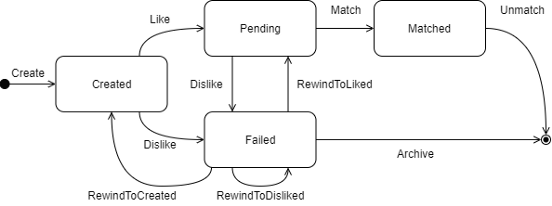

Using state machines to define behaviors and state transitions - explained with dating apps

## What's a state?

In information technology and computer science, a system is described as stateful if it is designed to remember preceding events or user interactions; the remembered information is called the state of the system.

A system's states are often defined by the aggregation of behaviors its users do. States are important because it's a more systematic way of verifying whether certain behaviors at certain states are valid or not.

### States of a traffic light

Consider a traffic light as an example. If it's been green, drivers and passengers expect to see yellow - not red - next. When it turns yellow, they'd expect red and not green. So the states here are simple:
```
Green -> Yellow -> Red
  ^                 |
  |_________________|
```

Follow the arrows (aka the allowed transitions of states) and your traffic light's good to go.

### States of the matches in dating apps

Now let's take a dating app as a more complicated example, imagine that we're building an app for people to "match" online. Let's say we have the algorithms ready and we need to start writing the logics behind the matches that pop up on our users' apps.

Let's define an entity match first to represent the match between two people. There are several states for a match we should take into consideration if we were to design it.

We need the states so that people won't see unexpected behaviors such as a random, not-matched person showing up on the screen saying hello.

My thought process:
1. First of all, a match has to be created, meaning a certain set of algorithms has to select two people ready for a match. Of course the algorithms need to make sure beforehand that they're both up for a match, fit each other's preferences, not banned, etc.
1. Then, this match could become either pending (waiting for another person's swipe) or failed depending on the first user's action. If the user swipes right (which means "I like you" in dating apps' terms), the state jumps from created to pending. If the user swipes left (meaning "I don't like you"), the state changes to failed.
1. Then if both people like each other, it goes from pending to matched.
1. Either of the person in a match could also "unmatch" a match, bringing the state to unmatched.
1. I think I got all the changes of states covered. But are these all? Hmm… isn't there's a paid feature called "rewind" which allows you to go back and swipe again? What should we do with this?

How do we ensure that we've included all changes? If so how do we program it?

## What's a state machine?

A methodology for modeling the behavior of an entity with an established lifecycle
When building state-oriented systems, state machines are useful to help us better determine the complicated transitions and triggers.

### Finite state machines (FSM)

It is an abstract machine that can be in exactly one of a finite number of states at any given time. The FSM can change from one state to another in response to some inputs; the change from one state to another is called a transition. An FSM is defined by a list of its states, its initial state, and the inputs that trigger each transition.

Let's carry on with our dating app example. If we create a state diagram from the logics behind a match, it looks somewhat like this:



* Different methods can be taken by different users involved: either of the matched customers, or the dating app (platform builder / company).

It has a finite number of states, modeling all behaviors within a match's lifecycle. To build a state machine, we just have to follow the lines and see how the entity responds to various behaviors.

## Why should I use a state machine?

Okay now I know that the state diagram is really helpful, yet still why should I use a state machine when I'm writing my code?

From the same example, let's take a look at some simplified code **before** and **after** a state machine's involved.

### Before using a state machine

```csharp
using System;
using System.Collections.Generic;

namespace State
{
    public enum MatchState
    {
        Created,
        Pending,
        Failed,
        Matched,
        Archived
    }

    public class MatchEntity
    {
        private IDictionary<Guid, bool?> liked; // swipe record
        public MatchState CurrentState { get; private set; }

        public MatchEntity()
        {
            CurrentState = MatchState.Created;
        }

        public MatchState Like()
        {
            if (CurrentState == MatchState.Created) 
            {
                CurrentState = MatchState.Pending;
                // do some stuff
                return CurrentState;
            }
            throw new NotSupportedException();
        }

        public MatchState Dislike()
        {
            if (CurrentState == MatchState.Created || CurrentState == MatchState.Pending) 
            {
                CurrentState = MatchState.Failed;
                // do some stuff
                return CurrentState;
            }
            throw new NotSupportedException();
        }

        public MatchState Match()
        {
            if (CurrentState == MatchState.Pending) 
            {
                CurrentState = MatchState.Matched;
                // do some stuff
                return CurrentState;
            }
            throw new NotSupportedException();
        }

        public MatchState Unmatch()
        {
            if (CurrentState == MatchState.Matched) 
            {
                CurrentState = MatchState.Archived;
                // do some stuff
                return CurrentState;
            }
            throw new NotSupportedException();
        }

        public MatchState RewindToCreated()
        {
            if (CurrentState == MatchState.Failed) 
            {
                CurrentState = MatchState.Created;
                // do some stuff
                return CurrentState;
            }
            throw new NotSupportedException();
        }

        public MatchState RewindToLiked()
        {
            if (CurrentState == MatchState.Failed) 
            {
                CurrentState = MatchState.Pending;
                // do some stuff
                return CurrentState;
            }
            throw new NotSupportedException();
        }

        public MatchState RewindToDislike()
        {
            if (CurrentState == MatchState.Failed) 
            {
                CurrentState = MatchState.Failed;
                // do some stuff
                return CurrentState;
            }
            throw new NotSupportedException();
        }

        public MatchState Archive()
        {
            if (CurrentState == MatchState.Failed) 
            {
                CurrentState = MatchState.Archived;
                // do some stuff
                return CurrentState;
            }
            throw new NotSupportedException();
        }
    }


    public class Program
    {
        static void Main(string[] args)
        {
            var match = new MatchEntity();
            Console.WriteLine("Current State = " + match.CurrentState);
            Console.WriteLine("Command.Like: Current State = " + match.Like());
            Console.WriteLine("Command.Dislike: Current State = " + match.Dislike());
            Console.WriteLine("Command.RewindToLiked: Current State = " + match.RewindToLiked());
            Console.WriteLine("Command.Match: Current State = " + match.Match());
            Console.WriteLine("Command.Unmatch: Current State = " + match.Unmatch());
        }
    }
}
```

You can spot a lot of if/else statements.

### After using a state machine

```csharp
using System;
using System.Collections.Generic;

namespace State
{
    public enum MatchState
    {
        Created,
        Pending,
        Failed,
        Matched,
        Archived
    }

    public enum Command
    {
        Create,
        Like,
        Dislike,
        RewindToCreated,
        RewindToLiked,
        RewindToDisliked,
        Match,
        Unmatch,
        Archive
    }

    public class StateTransition
    {
        readonly MatchState CurrentState;
        readonly Command Command;

        public StateTransition(MatchState currentState, Command command)
        {
            CurrentState = currentState;
            Command = command;
        }

        public override int GetHashCode()
        {
            return 17 + 31 * CurrentState.GetHashCode() + 31 * Command.GetHashCode();
        }

        public override bool Equals(object obj)
        {
            var other = obj as StateTransition;
            return other != null && this.CurrentState == other.CurrentState && this.Command == other.Command;
        }
    }

    public class MatchEntity
    {
        private IDictionary<Guid, bool?> liked; // swipe record
        private Dictionary<StateTransition, MatchState> transitions;
        public MatchState CurrentState { get; private set; }

        public MatchEntity()
        {
            CurrentState = MatchState.Created;
            transitions = new Dictionary<StateTransition, MatchState>
            {
                { new StateTransition(MatchState.Created, Command.Like), MatchState.Pending },
                { new StateTransition(MatchState.Created, Command.Dislike), MatchState.Failed },
                { new StateTransition(MatchState.Pending, Command.Match), MatchState.Matched },
                { new StateTransition(MatchState.Pending, Command.Dislike), MatchState.Failed },
                { new StateTransition(MatchState.Failed, Command.RewindToCreated), MatchState.Created },
                { new StateTransition(MatchState.Failed, Command.RewindToLiked), MatchState.Pending },
                { new StateTransition(MatchState.Failed, Command.RewindToDisliked), MatchState.Failed },
                { new StateTransition(MatchState.Failed, Command.Archive), MatchState.Archived },
                { new StateTransition(MatchState.Matched, Command.Unmatch), MatchState.Archived }
            };
        }

        public void ChangeState(Command command)
        {
            StateTransition transition = new StateTransition(CurrentState, command);
            if (!transitions.TryGetValue(transition, out var nextState))
                throw new NotSupportedException();
            CurrentState = nextState;
        }

        public MatchState Like()
        {
            ChangeState(Command.Like);
            // do some stuff
            return CurrentState;
        }

        public MatchState Dislike()
        {
            ChangeState(Command.Dislike);
            // do some stuff
            return CurrentState;
        }

        public MatchState Match()
        {
            ChangeState(Command.Match);
            // do some stuff
            return CurrentState;
        }

        public MatchState Unmatch()
        {
            ChangeState(Command.Unmatch);
            // do some stuff
            return CurrentState;
        }

        public MatchState RewindToCreated()
        {
            ChangeState(Command.RewindToCreated);
            // do some stuff
            return CurrentState;
        }

        public MatchState RewindToLiked()
        {
            ChangeState(Command.RewindToLiked);
            // do some stuff
            return CurrentState;
        }

        public MatchState RewindToDisliked()
        {
            ChangeState(Command.RewindToDisliked);
            // do some stuff
            return CurrentState;
        }

        public MatchState Archive()
        {
            ChangeState(Command.Archive);
            // do some stuff
            return CurrentState;
        }
    }


    public class Program
    {
        static void Main(string[] args)
        {
            var match = new MatchEntity();
            Console.WriteLine("Current State = " + match.CurrentState);
            Console.WriteLine("Command.Like: Current State = " + match.Like());
            Console.WriteLine("Command.Dislike: Current State = " + match.Dislike());
            Console.WriteLine("Command.RewindToLiked: Current State = " + match.RewindToLiked());
            Console.WriteLine("Command.Match: Current State = " + match.Match());
            Console.WriteLine("Command.Unmatch: Current State = " + match.Unmatch());
        }
    }
}
```

Let the `ChangeState` method take care of state transitions using `StateTransition` type. All other methods can now focus on the logics of handling the match.

## What more can I do?

Just to name a few:
- For now we assume that the "Rewind" methods are good enough for frontend interfaces to call. A more delicate way of dealing with methods should be to check if the match is recorded - and if so, is it liked or disliked - and then decide which command to use. Instead of letting the UI make the judgement (and risk it being wrong), it's more suggested that we handle it in the `MatchEntity` class.
- If the state transitions get too complicated, try using a matrix with axis of current states and commands. The data in the matrix can be the updated states. This way the code becomes more readable.

## Summary
So why use a state machine? Because considering the state-changing events (aka the important behaviors of an entity), it better models a system. Mostly everything else can be solved with basic CRUD methods. Also it makes your code more readable and maintainable.

When it comes to building APIs, don't design them only based on the requests product managers make. Design APIs (at least minimum APIs) for your entity with the critical behaviors and transitions - states - in mind.

## Reference

- [Richard Clayton - Use State Machines!](https://rclayton.silvrback.com/use-state-machines)
- [Wikipedia - Finite State Machines](https://en.wikipedia.org/wiki/Finite-state_machine)
- [StackOverflow - Simple state machine example in C#?](https://stackoverflow.com/questions/5923767/simple-state-machine-example-in-c)